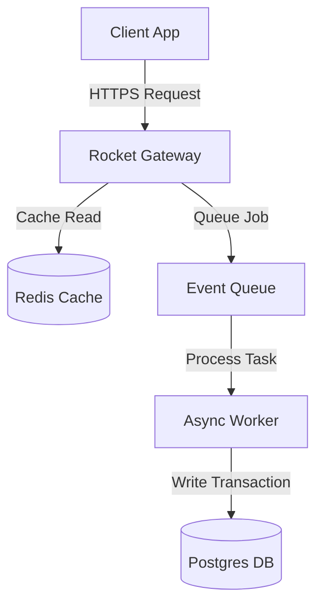

# Mega Core Architecture

A technical deep-dive into the architectural modules of Mega.

## Layer Structure

Mega uses a decoupled three-layer layout to isolate business rules from transport layers:

1. **Ingress API Gateway Layer:** Handled by Rocket API nodes, responsible for HTTPS termination, rate limiting, and JWT validation.
2. **Event Processing Pool (Worker Layer):** Asynchronous task consumers managing database transactions and write operations.
3. **Storage Engine Layer:** Scoped PostgreSQL database cluster paired with a Redis read-cache cluster.

---

## Data Flow Diagram

